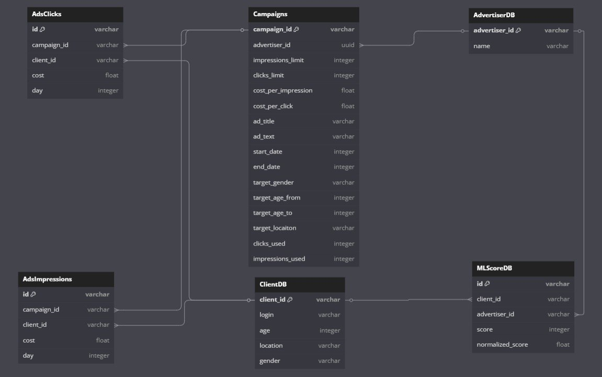
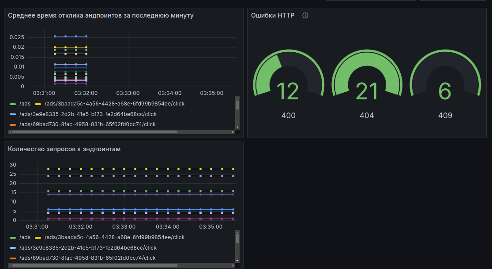
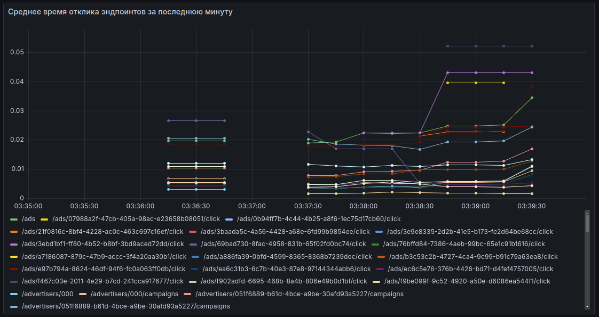
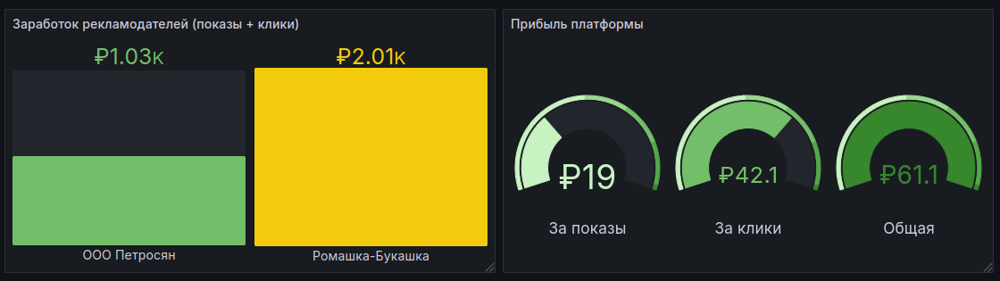

# PROD Backend 2025 Рекламная платформа 

## Инструкция по запуску
Для запуска приложения выполните команду
```commandline
docker-compose up -d
```
## Демонстрация работы
После запуска приложения API будет развернуто по адресу http://localhost:8080 и будет доступно для вызова.
Вы можете воспользоваться программой Postman или к вашим услугам удобная Swagger-документация с возможностью вызова API: http://localhost:8080/docs.


## Схема данных СУБД


### ClientsDB. Клиенты рекламных объявлений
| Поле      | Тип                            | Описание                                      |
|-----------|--------------------------------|-----------------------------------------------|
| client_id | varchar, primary key, not null | id клиента                                    |
| login     | varchar, not null              | Логин клиента                                 |
| age       | integer, not null              | Возраст клиента                               |
| location  | varchar, not null              | Локация клиента                               |
| gender    | varchar, not null              | Пол клиента. Возможные значения: MALE, FEMALE | 

### AdvertisersDB. Рекламодатели
| Поле          | Тип                            | Описание                        |
|---------------|--------------------------------|---------------------------------|
| advertiser_id | varchar, primary key, not null | id рекламодателя                |
| name          | varchar, not null              | Название компании-рекламодателя |

### MlScoresDB. Значения релевантности клиентов к компаниям
| Поле             | Тип                                               | Описание                                                                      |
|------------------|---------------------------------------------------|-------------------------------------------------------------------------------|
| id               | varchar, primary key, not null                    | id рекламодателя                                                              |
| client_id        | varchar, not null, foreign key for Clients.id     | id клиента                                                                    |
| advertiser_id    | varchar, not null, foreign key for Advertisers.id | id компании-рекламодателя                                                     |
| score            | integer, not null                                 | Скоринг, означающий уровень релевантности. Чем больше, тем выше релевантность |
| normalized_score | float, not null                                   | Скоринг, нормализованный к диапазону [0...1]                                  |

### Campaigns. Рекламные кампании
| Поле                | Тип                                            | Описание                                                       |
|---------------------|------------------------------------------------|----------------------------------------------------------------|
| campaign_id         | varchar, primary key, not null                 | id кампании                                                    |
| advertiser_id       | uuid, not null, foreign key for Advertisers.id | id рекламодателя                                               |
| impressions_limit   | integer, not null                              | Лимит показов объявлений                                       |
| clicks_limit        | integer, not null                              | Лимит кликов по объявлениям                                    |
| cost_per_impression | float, not null                                | Стоимость за 1 показ                                           |
| cost_per_click      | float, not null                                | Стоимость за 1 клик                                            |
| ad_title            | varchar, not null                              | Заголовок объявления                                           |
| ad_text             | varchar, not null                              | Текст объявления                                               |
| start_date          | integer, not null                              | Дата начала рекламной кампании включительно                    |
| end_date            | integer, not null                              | Дата окончания рекламной кампании включительно                 |
| target_gender       | varchar                                        | Таргет клиентов по полу. Возможные значения: MALE, FEMALE, ALL |
| target_age_from     | integer                                        | Нижняя граница возраста клиентов для таргетинга, включительно  |
| target_age_to       | integer                                        | Верхняя граница возраста клиентов для таргетинга, включительно |
| target_locaiton     | varchar                                        | Локация клиентов для таргетинга                                |
| clicks_used         | integer, not null                              | Кол-во сделанных кликов по объявлению                          |
| impressions_used    | integer, not null                              | Кол-во показов объявления                                      |

### AdsImpressions. Показы рекламных объявлений
| Поле        | Тип                                             | Описание              |
|-------------|-------------------------------------------------|-----------------------|
| id          | varchar, primary key, not null                  | id показа объявления  |
| campaign_id | varchar, not null, foreign key for Campaigns.id | id рекламной кампании |
| client_id   | varchar, not null, foreign key for Clients.id   | id клиента            |
| cost        | float, not null                                 | стоимость показа      |
| day         | integer, not null                               | день (дата) показа    |

### AdsClicks. Клики по рекламным объявлениям
| Поле        | Тип                                             | Описание               |
|-------------|-------------------------------------------------|------------------------|
| id          | varchar, primary key, not null                  | id клика по объявлению |
| campaign_id | varchar, not null, foreign key for Campaigns.id | id рекламной кампании  |
| client_id   | varchar, not null, foreign key for Clients.id   | id клиента             |
| cost        | float, not null                                 | стоимость клика        |
| day         | integer, not null                               | день (дата) клика      |

## Логика работы основных точек входа
После запуска приложения документация генерируется автоматически и доступна по адресу http://localhost:8080/docs.
Точки доступа API сгруппированы по категориям для удобства.

### Логика алгоритма показа рекламы
Для лучшего понимания внутренней логики работы сервиса приведу описание алгоритма отбора объвлений.

#### Фильтрация объявлений
Это отбор всех подходящих по условиям объявлений. Отбор идет по критериям:
* Актуальность. Текущий день должен быть >= дате начала и <= дате конца объявления
* Совпадение по полу, локации и возрасту клиента (таргетинг).
* Выход за рамки лимитов. Штрафы будут только при превышении показа на 5%, поэтому можно немного превысить, это учитывается.

#### Ранжирование объявлений
В ходе изучения тестовых данных стало понятно, что величина скоринга находится в диапазоне от 0 до 10 000. Поэтому при вставке каждого ML-скора также сохраняется нормированный скор. Это величина от 0 до 1, пропорциональная реальному значению скора.

Предполагаю, что большее значение ML-скора будет приводить к лучшей конверсии, то есть вероятности клика после показа, использую нормированный скор в формуле:
```
прибыльность_для_платформы = стоимость_показа + нормированный_скор * стоимость_перехода
weight_for_platform = cost_per_impression + normalized_score * cost_per_click
```
Эта формула помогает оценить прибыльность объявления для платформы. Но не учитывает то, что выгода платформы для нас вдвое выше важности ML-скора (по условию задания).
Поэтому составим такую формулу:
```
итоговый_вес = прибыльность_для_платформы * 2 + нормированный скор
total_weight = weight_for_platform * 2 + normalized_score
```

#### Реализация
Так как объявлений может быть много (тысячи), я решил делать фильтрацию и ранжирование одним действием с помощью SQL-запроса.
С помощью конструкции with я создаю набор уже отфильтрованных данных. Далее идет select первого ID объявления с сортировкой по итоговому весу по убыванию:
``` sql
select c.campaign_id, c.ad_title, c.ad_text, c.advertiser_id, 
	c.cost_per_impression, c.cost_per_click, s.score, s.normalized_score,
	(c.cost_per_impression + s.normalized_score*c.cost_per_click)*2 + s.normalized_score as weight
	from campaigndb c
	join MLScoreDB s on s.advertiser_id = c.advertiser_id
	join clientdb cl on cl.client_id = s.client_id
	where  
	(c.targeting_gender is null or c.targeting_gender = 'ALL' or c.targeting_gender = cl.gender)
	AND (c.targeting_age_from is null or c.targeting_age_from <= cl.age)
	AND (c.targeting_age_to is null or c.targeting_age_to >= cl.age)
	AND (c.targeting_location is null or c.targeting_location = cl.location)
	AND c.start_date <= :curday
	AND c.end_date >= :curday
	AND cl.client_id = :client_id
	AND (impressions_used+1)<(impressions_limit+impressions_limit*0.05) 
)
select campaign_id from d order by weight desc limit 1
```
Итоговая формула дорабатывается и может иметь незначительные отличия.
Да, решение выглядит громоздко и правки потребуют знания SQL, но на большом объеме данных это эффективнее в плане памяти и времени выполнения.

## Опциональные требования

### Добавление изображений в рекламных объявлениях
Реализована возможность прикреплять изображение к рекламному объявлению.
Добавление, удаление, замена и получение изображений происходит через группу конечных точек Images (подробнее в спецификации api). Изображение рекомендуется загружать в формате jpg или png для корректного отображения.

### Визуализация статистики
Визуализация статистики происходит через Grafana по адресу http://localhost:3000/. Логин - admin, пароль - admin1221
После входа необходимо перейти на вкладку Dashboards и выбрать один из дашбордов: системные или бизнес-метрики

Дашборд системных метрик отображает:
* Количество 500 и 4хх ошибок
* Среднее время отклика для каждого эндпоинта за минуту
* Количество запросов к эндпоинтам



Дашборд по бизнес-метрикам отображает:
* Общий заработок платформы
* Заработок платформы на показах и кликах 
* Расходы рекламодателей



### Модерация текстов рекламных кампаний
Модерация на этой рекламной платформе может осуществлятся двумя методами: через blacklist (слова в blacklist добавляются через /moderation/blacklist эндпоинт) и с помощью 
нейросети YandexGPT (Нейросеть проверяет содержание текста и заголовка и выдает вердикт). Я сделал и то, и другое потому что некоторые малоизвестные специфические слова нейросеть может счесть за нормальные, и их можно добавить в blacklist. 
Только лишь blacklist использовать не рекомендуется, так как его можно легко обойти с помощью спецсимовлов (например @ вместо буквы a). 
* Добавление blacklist-а происходит через эндпоинт post /moderation/blacklist
* Просмотр текущего blacklist-а происходит через эндпоинт get /moderation/blacklist
* Модерация объявления происходит через специальный эндпоинт post /moderation/campaigns

Модерация сделана на отдельном эндпоинте - так можно проверить что кампания которую планируется 
добавить проходит модерацию. Делать на эндпоинте добавления я ее не стал, так как это усложнит работу с api и смешает опциональные
требования (модерация) с обязательными (добавление кампаний), это не совсем корректно и может вызвать проблемы при автоматическом тестировании приложения.

### Генерация текстов объявлений с помощью LLM
Генерация текстов происходит с помощью нейросети YandexGPT, она анализирует данные кампании, рекламодателя, таргетирования и генерирует несколько вариантов
текста объявления. Генерация происходит через эндпоинт /advertisers/{advertiserId}/campaigns/{campaignId}/create-ai-text, подробнее смотреть в спецификации openapi.

## Описание технологий проекта
### СУБД - PostgreSQL
Структура данных не меняется, и нужно строить выборки с джойнами, поэтому принял решение работать с реляционной СУБД.

Причины выбора:
* Простая установка и настройка с помощью docker container
* Удобная интеграция с SqlModel в Python, можно работать и с моделями и писать кастомные sql-запросы 
* Открытое ПО

### Кэширование - Redis
Причины выбора:
* Простая установка с помощью docker container
* Высокая скорость работы
* Открытое ПО

### Тестирование - Tavern
Причины выбора:
* Хорошо подходит для интеграционного тестирования цепочек вызовов
* Хорошо читаемая структура тестов, нет лишных тегов и кавычек
* Настраиваемый уровень логирования, можно быстро понять где ошибка
* Открытое ПО

### LLM - YandexGPT
Я рассматривал разные LLM: ChatGPT, GigaChat, YandexGPT, провел сравнительный анализ. Я оценивал такие параметры, как: удобство подключения, качество генерации рекламных объявлений по запросу, качество модерации текстов объявлений.
Остановился именно на решении от Яндекса по этим причинам:
* Отечественное ПО, нет проблем с оплатой
* Победил в сравнении с Gigachat для модерации объявлений
* Высокая скорость работы
* Возможность использовать для как для задачи модерации, так и для генерации текста объявления


## Тестирование

### end-to-end тесты
Тестирование API сделано с помощью фреймворка Tavern. Тестами покрыт весь функционал API и разбит на отдельные файлы для удобства запуска 
Порядок запуска:
```shell
сd tests
pytest
```

